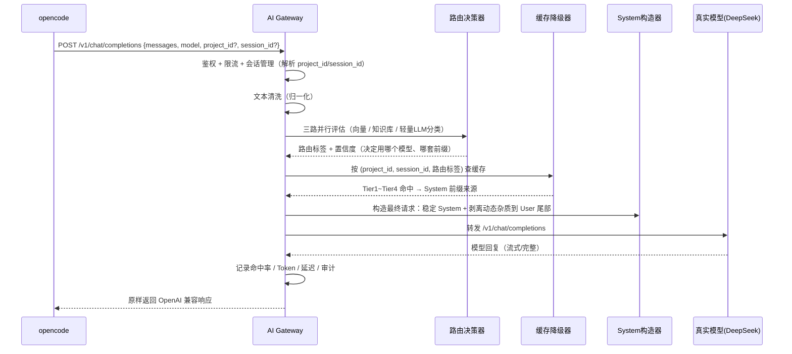

# AI Gateway 架构设计文档

> 版本：v0.5 · 状态：Phase 1-3 已实现（三路路由 + 免费模型交叉验证 + 权限分级拦截），Phase 4 部分完成（统计/审计/项目注册），待确认 #8 已解决
> 技术栈：Python 3.11 + FastAPI · 定位：LLM API 代理层（独立项目）

---

## 1. 定位与边界

### 1.1 一句话定位

**AI Gateway 是 Agent 与 LLM 之间的路由导航层**：位于中间，把 Agent 的请求清洗、增强、路由、构造 System 前缀，提升命中率、降低延迟和成本。它不思考、不记忆、不执行——只做导航指引。

**主形态是纯整形（refine）**：网关**不持有任何模型 key、不选模型、不替模型回复**。`POST /v1/refine` 返回"增强后的请求 + 路由元信息"，由 Agent 侧（opencodego）把 `refined.messages` 转发给用户当前选择的模型（用户切换模型只影响 Agent 侧，网关无感知）。转发模式（`/v1/chat/completions` 直连上游）仅作为可选形态保留。

### 1.2 位置与可插拔性（通用形态）

```
┌─────────────┐   原始请求   ┌──────────────┐   增强后的请求    ┌──────────────┐
│  Agent 侧   │ ──────────► │  AI Gateway  │ ──────────────► │  Agent 侧     │
│ (opencodego)│             │  (本项目)     │   refined.messages│ (同侧转发)    │
└─────────────┘             └──────────────┘                  └──────┬───────┘
                                                                    │ 用户当前选择的模型
                                                                    ▼
                                                             goapi / DeepSeek / 任何模型
```

**两端都是可插拔的：**
- **Agent 侧**：首个接入实例是 opencodego——先调 `/v1/refine` 拿增强后的请求，再把 `refined.messages` 发给用户当前选择的模型；未来可以是任何 Agent
- **LLM 侧**：网关不绑定任何模型——用户切换到哪个模型，opencodego 就把增强内容发给哪个模型（goapi / DeepSeek / 本地模型均可）
- **网关自身**：只负责中间的路由、导航、指引，不持有任何模型 key

### 1.3 它不是什么（边界红线）

| 不该做的事 | 说明 |
|---|---|
| 不做推理 | 网关不思考问题怎么解决，只做路由导航 |
| 不存长期记忆 | 不持有知识库 / 经验库（那是项目与模型的资产） |
| 不拥有技能 | 不实现 Agent 能力（Skill 类项目与网关无关） |
| 不执行操作 | 不调 K8s / 不写文件 / 不操作浏览器（那是 Agent 的事） |
| 不生成最终答案 | 它构造请求、选择模型、管理缓存，回复仍由模型生成 |
| 不绑定任何一端 | Agent 可换、模型可换，网关只做中间的路由导航指引 |

### 1.4 本项目的核心价值

| 能力 | 解决什么 | 怎么实现 |
|---|---|---|
| **命中率提升**（核心） | 模型侧 prompt 缓存命中率低 → 成本高、延迟高 | System 前缀稳定化：固化锚点 + 动态杂质剥离 |
| **成本控制** | 无法按问题难度选择模型 | 路由仲裁：简单问题走轻量模型，复杂问题走强模型 |
| **统一治理** | 多个客户端/密钥/项目混乱 | 鉴权、限流、会话管理、项目级配置 |
| **可观测** | 不知道命中率/成本/延迟 | 全量统计 + 审计 |

---

## 2. 总体架构

```
┌─────────────┐
│   opencode  │
└──────┬──────┘
       │ POST /v1/chat/completions（OpenAI 兼容）
       ▼
┌──────────────────────────────────────────────┐
│              AI Gateway                      │
│                                              │
│  L1 预处理 ──► L2 决策路由 ──► L3 缓存降级 ──► L4 System构造 ──► L5 出口/统计
│   鉴权/限流      三路仲裁         四层匹配        前缀稳定化      转发/拦截/统计
│   清洗/归一化    (向量+KB+LLM)    (Tier1-4)      动态上下文
│                                              │
└──────────────────────┬───────────────────────┘
                       │ 转发（真实模型调用）
                       ▼
              DeepSeek / 其他模型端点
```

### 2.1 核心设计原则

1. **Gateway 不思考**：构造请求、选模型、管缓存，不替模型回答问题，只做路由导航指引
2. **两端可插拔**：Agent 侧（opencode 或其他）与 LLM 侧（DeepSeek 或其他）都通过 OpenAI 兼容接口接入，互不绑定
3. **前缀稳定是第一优先**：System 前缀越稳定，模型侧缓存命中率越高（本网关存在的最大理由）
4. **永不落空**：四层缓存降级保证任何请求都能构造出可用的 System
5. **可独立演进**：第一版自研，未来可替换为 APISIX/Kong/Envoy AI Gateway，两端都不需要修改
6. **渐进式约束（先理解、后约束）**：先做最小范围的意图识别，再根据意图决定注入哪些规则，防止过早的精确性扼杀大模型的解决方案空间。实例：理论问题跳过行动协议锚点（skip_anchor）；模糊开发需求进入澄清模式并跳过全部技术栈注入

---

## 3. 请求生命周期（数据流）



---

## 4. 核心模块设计

### 4.1 L1 预处理层

| 子模块 | 职责 | 说明 |
|---|---|---|
| 鉴权 | API Key / 身份 | 每个客户端分配 key |
| 限流 | 速率限制 | 按 client_id 维度 |
| 会话管理 | 解析 project_id / session_id | 从请求头、消息内容或配置推断 |
| 文本归一化 | 统一换行符、压缩空格、清理异常字符 | "检查  k8s 节点" → "检查 k8s 节点" |

### 4.2 L2 决策路由层（三路并行仲裁）

```
请求
  │
  ├──► 路径A: 语义向量    （本地轻量 Embedding，如 all-MiniLM-L6-v2）
  │        → 相似问题匹配，输出 (标签, 相似度)
  │
  ├──► 路径B: 知识库      （项目规范/历史案例/规则文件）
  │        → 关键词/规则匹配，输出 (标签, 相关性)
  │
  └──► 路径C: 轻量LLM     （DeepSeek-V3 等做意图分类）
           → 输出 (标签, 置信度)
                    │
                    ▼
             ⚖️ 加权仲裁器
             score = w1*vec + w2*kb + w3*llm
                    │
                    ▼
       路由结果 {model_choice, system_source, tags, confidence}
```

要点：
- 路由结果决定：**用哪个模型**（轻/重）+ **哪套 System 前缀**（项目/通用）
- 知识库缺失时降级为"向量 + LLM"双路仲裁
- 仲裁器是纯规则加权，可独立替换

**快/中/慢三档（v0.4 实际实现顺序）：**

| 档位 | 路径 | 成本 | 说明 |
|---|---|---|---|
| 快 | 技术词直配（`route_name_from_terms`） | 0 LLM | 跨段并集提取技术词（mysql/java/k8s…），词→路由别名直接定标签 |
| 中 | 语义向量（TF-IDF n-gram / fastembed） | 本地 | **逐段匹配取 max**，防止长文本信号被稀释 |
| 慢 | LLM 分类器（可多路交叉验证） | 用户自定 | 输入为"路由摘要"而非原文：首段 + 技术词所在段 + 末段 |

**多分类器交叉验证（ClassifierEnsemble）**：分类器端点由用户自定（`gateway.classifiers`，任意 OpenAI 兼容端点——Ollama 本地免费免密钥 / DeepSeek / 中转站），网关**不绑定任何模型厂商**。配置多个时：
- 并发调用全部分类器（`asyncio.gather`），各自独立超时，失败不计票
- 按权重加权投票：`votes[路线] += weight`；全部一致 → agreement=1.0，不一致 → 票高者胜，`agreement = 得票权重占比`（即路由得分随一致性下降，路由决策留痕可见）
- 全部失败 → None，自然降级（技术词/向量路径不受影响）
- 未配 classifiers 时回退 `upstream.default` 单分类器；都没有则纯本地规则路由
- 密钥可空（空则不带 Authorization 头），本地模型与中转站通常不校验

**长文本分段路由**：请求先按换行切段（`split_segments`，过滤寒暄/废话段），技术词从**所有段**并集提取——关键信息在第 3 段也能命中；向量逐段打分取最高；LLM 分类器只读路由摘要（≤500 字符），替代旧版"前 500 字符"（关键信息在后段时必然判错）。多领域长文 v1 取最高分单一标签，top-k 多标签留作后续。

**复制粘贴型长文本（墙式文本）处理**：
- 无换行的超长单段（≥300 字符）按**句子边界二次切分**（。！？；!?;），无句读的纯日志按定长切块 → 向量信号不再被稀释
- 意图可能在中间段且无技术词 → **向量得分最高的段（best_segment）并入路由摘要**，不再只靠"首段+末段"
- 技术词快路径永远扫描全量原文（不依赖分段），最坏情况由 LLM 分类器兜底，转发上游的原文永远不变

**摘要的保真契约（防歧义丢失）★**：
- **摘要只影响路由决策，转发给上游的原文永远不变**——摘要出错的最坏结果是路由标签/Tier1 画像偏差，模型仍能看到全文，风险有界
- **抽取式而非生成式**：模型只允许"选原文段"，禁止改写——"不用 MySQL"里的"不用"只要在选中的段内就逐字保留
- **保真闸门（确定性规则）**：`apply_fidelity_guards` 强制把含**否定词**（不/没/别/非/禁/不要…）、**连接词**（和/与/或者/以及…）、**关键符号**（&&/||/=>/::/!=）的段并入摘要——即使模型没选它们
- **幻觉校验**：外部模型返回的段必须逐字等于原文段（`s in segs`），否则整体弃用，回退确定性路径（技术词段+首段+末段+闸门）
- **可插拔本地模型**：`digest.local_picker`（Ollama 等，默认关闭）做抽取式选段，失败/超时/不可用自动降级，零风险开启

### 4.2.1 需求澄清模式（模糊开发需求）★

**触发**：`is_vague_development_request` —— 最后一条 user 消息含开发动词（开发/做一个/帮我写/写一个…）、**无任何技术栈词**、未否定（"不需要开发"）、≤60 字符（长文本自带规格）、非理论问题（"什么是…"不触发）。

**处理路径**（检测于 L2 之前，节省分类器调用）：

```
"开发一个手机清理工具"
   │ 检测通过（无技术词 + 开发动词 + 短文本）
   ▼
跳过整个 L2 路由（不调向量/不调 LLM 分类器，省成本）
   ▼
强制 Tier4（零技术栈注入——技术栈正是要问的目标，提前注入会带偏模型）
   ▼
skip_anchor（状态优先协议对"提问环节"无意义）
   ▼
澄清提示词注入 User 尾部（非 System！）：
   - System 前缀保持稳定 → 不破坏模型侧缓存命中
   - 每轮自然失效 = 天然 one-shot
   ▼
模型输出 4 个澄清问题（平台/痛点/用户/从零开始）
   ▼
用户回答 → 下一轮含平台信息 → 命中技术词快路径或 Tier3 会话摘要 → 正常落地
```

**关键约束**：
- **每会话最多一轮**：用户回答"随便"（仍无技术词）不会无限追问——`CacheEngine.mark_clarified` 做会话级标记，第二轮起走正常路由
- 澄清提示词配置化（`config.yaml` 的 `gateway.clarify_prompt`），可自定义问题
- 审计记录 `clarify: true`，统计含 clarify 计数（可观测拦截效果）

### 4.2.2 路由观测（Routing Ledger）★

路由是"经验系统"，运行一段时间后必须能回看决策质量才能调优（阈值/词表/画像）。每次路由决策写入明细账：

```
logs/routing/routing-YYYY-MM-DD.jsonl（每日轮转，与审计同保留周期）
字段：ts / request_id / project_id / session_id / text_len / segments /
      terms（命中的技术词）/ source（cache|term|vector|llm|fallback|clarify-skip）/
      route / score / tier / clarify / digest_len / fidelity_forced /
      vector_latency_ms / judge_latency_ms / vector_scores（各画像最高分段得分 top3）
```

**调优入口 `GET /v1/stats/routing`** 返回聚合：
- `by_source`：决策来源分布——term 占比过高说明词表命中多（可精简），fallback/llm 占比过高说明词表或画像要扩充
- `top_terms`：真实流量高频技术词——与词表对照，缺的补进 `TECH_TERMS`
- `avg_vector_latency_ms` / `avg_judge_latency_ms`：成本与延迟画像（判断是否值得开本地抽取模型）
- `avg_fidelity_forced`：保真闸门平均挽回段数——若持续为 0 说明闸门从未触发，可检查 `_FIDELITY_RE` 覆盖面

审计（audit JSONL）管"合规谁问了什么"，Ledger 管"路由选得准不准"，二者互补。

### 4.3 L3 缓存降级层（四层回退，永不落空）

| Tier | 名称 | Key | 内容来源 | 命中条件 |
|---|---|---|---|---|
| Tier1 | 全球技术栈缓存 | 路由标签 | 跨项目共享通用规范 | 标签匹配（如 Java/Oracle） |
| Tier2 | 项目级缓存 | project_id | 项目 AGENTS.md | project_id 命中 |
| Tier3 | 会话级缓存 | session_id | 会话历史摘要 | session_id 命中 |
| Tier4 | 兜底 | - | 空 System | 全未命中 |

关键规则：
- **项目 ID 与 会话 ID 都是缓存 Key**
- Tier3 会话级命中优先于 Tier4 兜底——即使仲裁没找到好前缀，也按会话 ID 匹配历史摘要，**不做"空 System"处理**
- 缓存内容只要求"前缀匹配"，不要求输出精炼（重点是输入侧前缀稳定）

### 4.4 L4 System 构造层（前缀稳定化 ★核心）

```
最终请求 = System: [稳定前缀锚点（Tier1~Tier4 命中产物，尽量稳定不变）]
                 + [状态优先行动协议（Tier2 家风命中即注入）]
                 + [动态上下文（项目/会话/环境信息）]
         + User: [原始消息] + [剥离后的动态杂质（时间戳/随机数）]

原则：动态的东西全部下沉到 User 尾部，System 只放稳定内容
```

**为什么这样能提升命中率：**
- DeepSeek 等模型的 prompt 缓存（context caching）按**前缀**匹配
- System 前缀稳定 → 相同前缀直接命中缓存 → 成本大幅下降、首字延迟降低
- 若把时间戳/随机数放进 System，前缀每次变化 → 缓存永远不命中（这是当前很多客户端命中率低的主因）

**命中率统计**（上报/展示）：
- 请求前缀与上次请求的公共前缀长度（缓存收益）
- 四层 Tier 命中分布
- 模型侧缓存命中状态（如 DeepSeek 返回的 `prompt_cache_hit_tokens`）

### 4.5 权限体系（三级行动权限）

> 网关本身只转发请求不执行操作，指令级**危险扫描拦截**面向转发链路：识别用户消息中的高危指令（rm -rf / DROP / format / shutdown / kill -9 等），按权限等级决定 allow / confirm / block。等级默认 L1（config `security.default_level`），可用请求头 `x-permission-level` 覆盖。实现在 `app/layers/permissions.py`，拦截结果写入 Routing Ledger 与响应头 `X-Gateway-Permission*`。

| 等级 | 适用场景 | 可调用工具 | 禁止行为 | 网关动作 |
|---|---|---|---|---|
| L0 侦察兵 | "看看/查一下/读一下" | 只读：read_file、ls、grep、browser_get_url | 写入、删除、重启、网络请求 | 高危指令 → block（拦截） |
| L1 执行员 | "改配置/跑测试" | 读写：write_file、run_test | rm -rf、kill -9、改内核 | 高危指令 → block（拦截） |
| L2 指挥官 | "部署/迁移" | 全量，但高危需 --confirm | 无 | 高危指令 → confirm（放行+二次确认） |

### 4.5.1 状态优先行动协议（State-First Protocol）★

本项目**最高优先级的行动准则**：行动力要强，破坏力要为零。先看状态，再谈行动；先自查，再拒绝。

**协议一：状态优先（State First）——先侦察，后行动**

任何任务的第一步，永远是用**只读工具**获取状态，禁止跳过侦察直接下结论或拒绝：

- 侦察**永远被授权**，与当前权限等级无关（L0 是默认底线，不是可选项）
- "看看浏览器登没登录"这种验证性侦察，必须自己先做，**不允许不查就拒绝**
- 反例（禁止）：说"需要登录才能访问"，却不先验证自己是否已登录
- 正例（要求）：先查浏览器 profile / cookies → 确认登录态 → 再判断能否访问

**协议二：拒绝前自查（Check Before Refuse）——拒绝是最后手段**

想说"不能做 / 做不到 / 需要授权 / 缺少工具"之前，必须完成自查链：
1. 是否已用只读工具验证过现状？（没查过 → 先查，禁止空口拒绝）
2. 是否有影响最小的替代工具/替代路径？（如 webfetch 代替浏览器自动化）
3. 阻碍是否可以通过「先做一部分」绕开？
4. 阻碍是否真的不可逆/有破坏性？（纯只读操作不应被视为"危险"）

全部通过 → 才可以拒绝，且必须附上自查证据。

**协议三：行动前自查（三思而行）——只针对写操作**

写入/变更类操作执行前必须逐条自检：
1. 影响范围：影响多少个文件/服务/用户？（必须量化）
2. 可逆性：有无回滚方案？没有 → 禁止执行
3. 环境隔离：当前是开发/测试/生产？生产 → 停止并请求人工授权

| 协议 | 动作类型 | 是否需授权 | 设计意图 |
|---|---|---|---|
| 状态优先 | 所有请求的第一步（只读） | 永不需授权 | 杜绝"光分析不执行" |
| 拒绝前自查 | 拒绝行为本身 | 永不需授权 | 杜绝"不验证就拒绝" |
| 行动前自查 | 写/删/改/重启 | 按等级授权 | 杜绝"乱执行闯祸" |

### 4.5.2 项目家风固化（AGENTS.md 模板）

状态优先协议必须**固化为项目级规则**，随 AGENTS.md 注入 Tier2 缓存。标准模板：

```markdown
## [项目家风 - 状态优先行动协议]（最高优先级，覆盖所有其他规则）
### 行动力要强，破坏力为零
1. 任何任务第一步必须用只读工具获取状态（read/ls/grep/webfetch/状态查询），
   禁止不侦察就下结论或拒绝。
2. 说"不能/做不到/需要登录/缺少工具"之前，必须先用只读工具自查：
   - 是否已验证现状？（如先检查浏览器登录态，而不是假设需要登录）
   - 是否有影响更小的替代工具？（如 webfetch 代替浏览器自动化）
   - 能否先完成可只读完成的部分？
   未完成自查禁止拒绝；拒绝时必须附上自查证据。
3. 纯只读操作永不视为"危险"，不需要额外授权。
4. 写/删/改/重启类操作执行前必须自检：影响范围（量化）→ 可逆性（有回滚）→
   环境隔离（生产环境停止并请求人工授权）。未自检完禁止行动。

## [安全红线 - 不可触碰区域]
- 禁止在未明确指定环境的情况下修改 /etc/ 或 ~/.ssh/ 目录
- 禁止自动执行数据库 DELETE / DROP（必须人工确认）
- 浏览器操作禁止调用 browser_close / browser_restart（只允许只读和点击）
```

### 4.6 出口层（L5）

- 转发：调用真实模型（OpenAI 兼容），支持流式
- 记录：request_id / 命中 Tier / 路由标签 / Token / 延迟 / 权限等级
- 审计：全量落盘（谁、何时、问了什么、路由到哪）
- 拦截：危险指令扫描（工具代理模式时生效）

---

## 5. API 接口草案（v1）

**对外（opencodego 对接）：**

```
POST /v1/refine                 # ★主端点：请求整形（清洗/路由/System 构造），零模型依赖
                                #   返回 refined.messages + meta（路由/Tier/澄清/保真统计）
POST /v1/chat/completions       # 可选转发模式（需配置 upstream.base_url 才可用）
GET  /v1/models                 # 模型列表（整形模式返回空，模型由 Agent 侧决定）
```

**管理接口：**

```
POST /v1/projects                # 注册项目（绑定 AGENTS.md 路径）
POST /v1/sessions                # 创建会话
GET  /v1/stats/hits              # 命中率统计
GET  /v1/stats/routing           # 路由决策明细账摘要（来源/Tier/词频/延迟，调优入口）
GET  /v1/audit?client_id=        # 审计查询
GET  /v1/health                  # 健康检查
```

**opencode 接入方式（示意）：**

```jsonc
// opencode.json 中配置自定义 provider
{
  "provider": {
    "deepseek-via-gateway": {
      "npm": "@ai-sdk/openai-compatible",
      "options": {
        "baseURL": "http://127.0.0.1:8080/v1",
        "apiKey": "gateway-key-xxx"
      },
      "models": { "deepseek-chat": {} }
    }
  }
}
```

配置示例（config.yaml）：

```yaml
auth:
  api_keys:
    default: ${GATEWAY_API_KEY}

upstream:
  deepseek:
    base_url: https://api.deepseek.com/v1
    api_key: ${DEEPSEEK_API_KEY}

routing:
  vector_model: all-MiniLM-L6-v2
  llm_classifier: deepseek-chat
  weights: { vector: 0.3, kb: 0.3, llm: 0.4 }
  thresholds: { min_confidence: 0.6 }

cache:
  tier1_ttl_hours: 720
  tier2_file: "{project_dir}/AGENTS.md"
  tier3_max_sessions: 200

security:
  default_level: L0
  dangerous_patterns: ["rm -rf", "DROP DATABASE", "shutdown -h"]
  redlines_source: AGENTS.md #[安全红线]
```

---

## 6. 项目目录结构（目标形态）

```
ai-gateway/
├── app/
│   ├── main.py              # FastAPI 入口
│   ├── api/                 # OpenAI 兼容端点 + 管理端点
│   ├── core/                # 配置/依赖/鉴权
│   ├── layers/
│   │   ├── preprocess.py    # L1 清洗
│   │   ├── router.py        # L2 三路仲裁
│   │   ├── cache.py         # L3 四层降级
│   │   ├── system_builder.py# L4 System构造（前缀稳定化）
│   │   ├── permissions.py   # 状态优先协议 + 分级 + 拦截
│   │   └── stats.py         # 出口统计/审计
│   └── upstream/            # 上游模型转发（OpenAI 兼容）
├── tests/
├── config.yaml
└── README.md
```

---

## 7. 落地路线图

| Phase | 内容 | 目标 | 状态 |
|---|---|---|---|
| **Phase 1**（MVP） | OpenAI 兼容转发 + 鉴权 + 状态优先协议注入 + 会话管理 | opencode 能通过网关对话，命中率可见 | ✅ 已实现 |
| **Phase 2** | 精确响应缓存 + 四层缓存降级 + System 前缀稳定化 + 动态杂质剥离 + 项目注册 + 会话摘要回填 | 命中率明显提升（成本/延迟下降） | ✅ 已实现 |
| **Phase 3** | 三路路由仲裁 + 模型选择（轻/重） | 简单问题走轻量模型，成本优化 | ✅ 已实现 |
| **Phase 4** | 统计/审计完善 + 项目注册 API + 权限分级 | 可观测、可治理 | 🟡 部分（统计/审计/项目注册完成，限流未做） |

---

## 8. 待确认问题（评审时讨论）

1. 命中率如何量化展示：上报 DeepSeek 的 `prompt_cache_hit_tokens` vs 网关自算公共前缀长度？— ✅ 已采用网关自算公共前缀（`stats.record_prefix`），上游 `prompt_cache_hit_tokens` 解析保留在响应缓存层
2. 会话/项目 ID 从哪来：请求头注入 vs opencode 消息内容识别 vs 配置映射？— ✅ 已采用请求头 `x-project-id` / `x-session-id` / `x-user-id`（缺省 default）
3. 存储选型：SQLite（单机 MVP）→ PostgreSQL / Redis（规模化）？— ⏳ MVP 用内存 + JSON 文件，规模化时再迁
4. 向量库：Chroma（内嵌 MVP）→ LanceDB / Milvus？— ⏳ 当前用内置轻量向量近似（SemanticRouter），规模化时再迁
5. 轻量分类模型是否一期就做（Phase 3）？还是先固定模型直连？— ✅ Phase 3 已做：多分类器本地池轮询单分类器 + 第一个成功者出票（注意：非并发加权投票，实现见 app/upstream/classifier.py ClassifierEnsemble）；默认接入 opencode Zen 免费模型（免 key）
6. 流式响应是否一期支持（opencode 依赖流式，**建议一期必做**）？— ✅ 已支持（`/v1/chat/completions` SSE 流式）
7. 审计保留策略？— ✅ 已实现 `audit.keep_days` 滚动清理（默认 30 天）
8. **Tier1/Tier2 命中时 Tier3 会话摘要被丢弃**— ✅ 已解决：`resolve` 改为 Tier1/2 命中后**合并追加** Tier3 摘要（`_merge_session`，见 app/layers/cache.py），多轮会话上下文延续
9. 多领域长文本是否支持 top-k 多标签路由（当前单一标签取最高分）？— ⏳ 未做，单一标签
