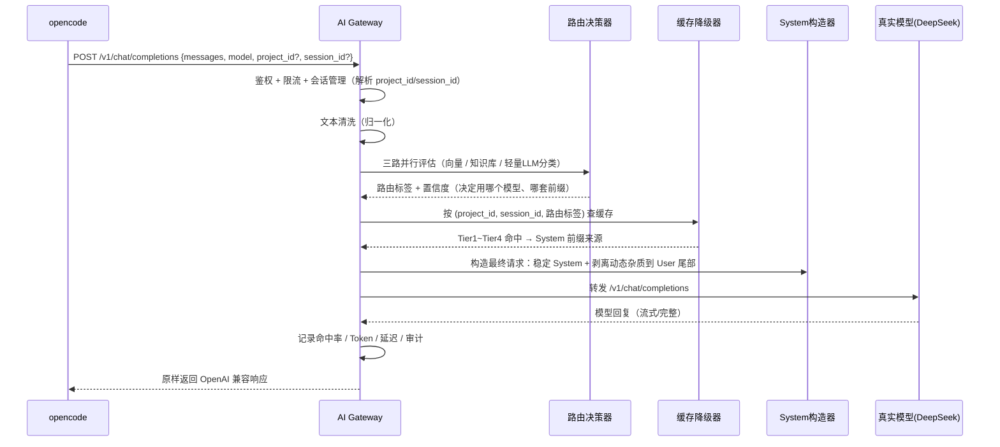

# AI Gateway 架构设计文档

> 版本：v0.3 · 状态：Phase 1 + Phase 2 已实现，Phase 3 设计待评审
> 技术栈：Python 3.11 + FastAPI · 定位：LLM API 代理层（独立项目）

---

## 1. 定位与边界

### 1.1 一句话定位

**AI Gateway 是 Agent 与 LLM 之间的路由导航层**：位于中间，把 Agent 的请求路由导航到合适的模型，通过"System 前缀稳定化 + 缓存降级 + 路由仲裁"提升命中率、降低延迟和成本。它不思考、不记忆、不执行——只做导航指引。

### 1.2 位置与可插拔性（通用形态）

```
┌─────────────┐      OpenAI 兼容 API       ┌──────────────┐      上游调用       ┌──────────────┐
│  Agent 侧   │ ────────────────────────► │  AI Gateway  │ ────────────────► │  LLM 侧      │
│  (可插拔)    │  POST /v1/chat/completions │  (本项目)     │   转发             │  (可插拔)     │
└─────────────┘                           └──────────────┘                    └──────────────┘
   opencode / 其他 Agent                  仅做路由导航指引                    DeepSeek / 其他模型
```

**两端都是可插拔的：**
- **Agent 侧**：首个接入实例是 opencode（配 `base_url` 指向网关即可，客户端零改动）；未来可以是任何 Agent——接口形态都是 OpenAI 兼容
- **LLM 侧**：首期对接 DeepSeek；未来任何模型（OpenAI / Claude / 本地模型）——只需新增一个 upstream 配置
- **网关自身**：只负责中间的路由、导航、指引，不绑定任何一端

### 1.3 它不是什么（边界红线）

| 不该做的事 | 说明 |
|---|---|
| 不做推理 | 网关不思考问题怎么解决，只做路由导航 |
| 不存长期记忆 | 不持有知识库 / 经验库（那是项目与模型的资产） |
| 不拥有技能 | 不实现 Agent 能力（Skill 类项目与网关无关） |
| 不执行操作 | 不调 K8s / 不写文件 / 不操作浏览器（那是 Agent 的事） |
| 不生成最终答案 | 它构造请求、选择模型、管理缓存，回复仍由模型生成 |
| 不绑定任何一端 | Agent 可换、模型可换，网关只做中间的路由导航指引 |

### 1.4 本项目的核心价值

| 能力 | 解决什么 | 怎么实现 |
|---|---|---|
| **命中率提升**（核心） | 模型侧 prompt 缓存命中率低 → 成本高、延迟高 | System 前缀稳定化：固化锚点 + 动态杂质剥离 |
| **成本控制** | 无法按问题难度选择模型 | 路由仲裁：简单问题走轻量模型，复杂问题走强模型 |
| **统一治理** | 多个客户端/密钥/项目混乱 | 鉴权、限流、会话管理、项目级配置 |
| **可观测** | 不知道命中率/成本/延迟 | 全量统计 + 审计 |

---

## 2. 总体架构

```
┌─────────────┐
│   opencode  │
└──────┬──────┘
       │ POST /v1/chat/completions（OpenAI 兼容）
       ▼
┌──────────────────────────────────────────────┐
│              AI Gateway                      │
│                                              │
│  L1 预处理 ──► L2 决策路由 ──► L3 缓存降级 ──► L4 System构造 ──► L5 出口/统计
│   鉴权/限流      三路仲裁         四层匹配        前缀稳定化      转发/拦截/统计
│   清洗/归一化    (向量+KB+LLM)    (Tier1-4)      动态上下文
│                                              │
└──────────────────────┬───────────────────────┘
                       │ 转发（真实模型调用）
                       ▼
              DeepSeek / 其他模型端点
```

### 2.1 核心设计原则

1. **Gateway 不思考**：构造请求、选模型、管缓存，不替模型回答问题，只做路由导航指引
2. **两端可插拔**：Agent 侧（opencode 或其他）与 LLM 侧（DeepSeek 或其他）都通过 OpenAI 兼容接口接入，互不绑定
3. **前缀稳定是第一优先**：System 前缀越稳定，模型侧缓存命中率越高（本网关存在的最大理由）
4. **永不落空**：四层缓存降级保证任何请求都能构造出可用的 System
5. **可独立演进**：第一版自研，未来可替换为 APISIX/Kong/Envoy AI Gateway，两端都不需要修改

---

## 3. 请求生命周期（数据流）



---

## 4. 核心模块设计

### 4.1 L1 预处理层

| 子模块 | 职责 | 说明 |
|---|---|---|
| 鉴权 | API Key / 身份 | 每个客户端分配 key |
| 限流 | 速率限制 | 按 client_id 维度 |
| 会话管理 | 解析 project_id / session_id | 从请求头、消息内容或配置推断 |
| 文本归一化 | 统一换行符、压缩空格、清理异常字符 | "检查  k8s 节点" → "检查 k8s 节点" |

### 4.2 L2 决策路由层（三路并行仲裁）

```
请求
  │
  ├──► 路径A: 语义向量    （本地轻量 Embedding，如 all-MiniLM-L6-v2）
  │        → 相似问题匹配，输出 (标签, 相似度)
  │
  ├──► 路径B: 知识库      （项目规范/历史案例/规则文件）
  │        → 关键词/规则匹配，输出 (标签, 相关性)
  │
  └──► 路径C: 轻量LLM     （DeepSeek-V3 等做意图分类）
           → 输出 (标签, 置信度)
                    │
                    ▼
             ⚖️ 加权仲裁器
             score = w1*vec + w2*kb + w3*llm
                    │
                    ▼
       路由结果 {model_choice, system_source, tags, confidence}
```

要点：
- 路由结果决定：**用哪个模型**（轻/重）+ **哪套 System 前缀**（项目/通用）
- 知识库缺失时降级为"向量 + LLM"双路仲裁
- 仲裁器是纯规则加权，可独立替换

### 4.3 L3 缓存降级层（四层回退，永不落空）

| Tier | 名称 | Key | 内容来源 | 命中条件 |
|---|---|---|---|---|
| Tier1 | 全球技术栈缓存 | 路由标签 | 跨项目共享通用规范 | 标签匹配（如 Java/Oracle） |
| Tier2 | 项目级缓存 | project_id | 项目 AGENTS.md | project_id 命中 |
| Tier3 | 会话级缓存 | session_id | 会话历史摘要 | session_id 命中 |
| Tier4 | 兜底 | - | 空 System | 全未命中 |

关键规则：
- **项目 ID 与 会话 ID 都是缓存 Key**
- Tier3 会话级命中优先于 Tier4 兜底——即使仲裁没找到好前缀，也按会话 ID 匹配历史摘要，**不做"空 System"处理**
- 缓存内容只要求"前缀匹配"，不要求输出精炼（重点是输入侧前缀稳定）

### 4.4 L4 System 构造层（前缀稳定化 ★核心）

```
最终请求 = System: [稳定前缀锚点（Tier1~Tier4 命中产物，尽量稳定不变）]
                 + [状态优先行动协议（Tier2 家风命中即注入）]
                 + [动态上下文（项目/会话/环境信息）]
         + User: [原始消息] + [剥离后的动态杂质（时间戳/随机数）]

原则：动态的东西全部下沉到 User 尾部，System 只放稳定内容
```

**为什么这样能提升命中率：**
- DeepSeek 等模型的 prompt 缓存（context caching）按**前缀**匹配
- System 前缀稳定 → 相同前缀直接命中缓存 → 成本大幅下降、首字延迟降低
- 若把时间戳/随机数放进 System，前缀每次变化 → 缓存永远不命中（这是当前很多客户端命中率低的主因）

**命中率统计**（上报/展示）：
- 请求前缀与上次请求的公共前缀长度（缓存收益）
- 四层 Tier 命中分布
- 模型侧缓存命中状态（如 DeepSeek 返回的 `prompt_cache_hit_tokens`）

### 4.5 权限体系（三级行动权限）

> 网关本身只转发请求不执行操作，此权限体系面向的是**后续可能的工具代理模式**（如网关代客户端执行工具），当前阶段仅注入"状态优先行动协议"作为 System 家风。

| 等级 | 适用场景 | 可调用工具 | 禁止行为 | 网关动作 |
|---|---|---|---|---|
| L0 侦察兵 | "看看/查一下/读一下" | 只读：read_file、ls、grep、browser_get_url | 写入、删除、重启、网络请求 | 工具列表只传 read_*/list_* |
| L1 执行员 | "改配置/跑测试" | 读写：write_file、run_test | rm -rf、kill -9、改内核 | 排除高危工具 |
| L2 指挥官 | "部署/迁移" | 全量，但高危需 --confirm | 无 | 出口拦截 → 请求二次确认 |

### 4.5.1 状态优先行动协议（State-First Protocol）★

本项目**最高优先级的行动准则**：行动力要强，破坏力要为零。先看状态，再谈行动；先自查，再拒绝。

**协议一：状态优先（State First）——先侦察，后行动**

任何任务的第一步，永远是用**只读工具**获取状态，禁止跳过侦察直接下结论或拒绝：

- 侦察**永远被授权**，与当前权限等级无关（L0 是默认底线，不是可选项）
- "看看浏览器登没登录"这种验证性侦察，必须自己先做，**不允许不查就拒绝**
- 反例（禁止）：说"需要登录才能访问"，却不先验证自己是否已登录
- 正例（要求）：先查浏览器 profile / cookies → 确认登录态 → 再判断能否访问

**协议二：拒绝前自查（Check Before Refuse）——拒绝是最后手段**

想说"不能做 / 做不到 / 需要授权 / 缺少工具"之前，必须完成自查链：
1. 是否已用只读工具验证过现状？（没查过 → 先查，禁止空口拒绝）
2. 是否有影响最小的替代工具/替代路径？（如 webfetch 代替浏览器自动化）
3. 阻碍是否可以通过「先做一部分」绕开？
4. 阻碍是否真的不可逆/有破坏性？（纯只读操作不应被视为"危险"）

全部通过 → 才可以拒绝，且必须附上自查证据。

**协议三：行动前自查（三思而行）——只针对写操作**

写入/变更类操作执行前必须逐条自检：
1. 影响范围：影响多少个文件/服务/用户？（必须量化）
2. 可逆性：有无回滚方案？没有 → 禁止执行
3. 环境隔离：当前是开发/测试/生产？生产 → 停止并请求人工授权

| 协议 | 动作类型 | 是否需授权 | 设计意图 |
|---|---|---|---|
| 状态优先 | 所有请求的第一步（只读） | 永不需授权 | 杜绝"光分析不执行" |
| 拒绝前自查 | 拒绝行为本身 | 永不需授权 | 杜绝"不验证就拒绝" |
| 行动前自查 | 写/删/改/重启 | 按等级授权 | 杜绝"乱执行闯祸" |

### 4.5.2 项目家风固化（AGENTS.md 模板）

状态优先协议必须**固化为项目级规则**，随 AGENTS.md 注入 Tier2 缓存。标准模板：

```markdown
## [项目家风 - 状态优先行动协议]（最高优先级，覆盖所有其他规则）
### 行动力要强，破坏力为零
1. 任何任务第一步必须用只读工具获取状态（read/ls/grep/webfetch/状态查询），
   禁止不侦察就下结论或拒绝。
2. 说"不能/做不到/需要登录/缺少工具"之前，必须先用只读工具自查：
   - 是否已验证现状？（如先检查浏览器登录态，而不是假设需要登录）
   - 是否有影响更小的替代工具？（如 webfetch 代替浏览器自动化）
   - 能否先完成可只读完成的部分？
   未完成自查禁止拒绝；拒绝时必须附上自查证据。
3. 纯只读操作永不视为"危险"，不需要额外授权。
4. 写/删/改/重启类操作执行前必须自检：影响范围（量化）→ 可逆性（有回滚）→
   环境隔离（生产环境停止并请求人工授权）。未自检完禁止行动。

## [安全红线 - 不可触碰区域]
- 禁止在未明确指定环境的情况下修改 /etc/ 或 ~/.ssh/ 目录
- 禁止自动执行数据库 DELETE / DROP（必须人工确认）
- 浏览器操作禁止调用 browser_close / browser_restart（只允许只读和点击）
```

### 4.6 出口层（L5）

- 转发：调用真实模型（OpenAI 兼容），支持流式
- 记录：request_id / 命中 Tier / 路由标签 / Token / 延迟 / 权限等级
- 审计：全量落盘（谁、何时、问了什么、路由到哪）
- 拦截：危险指令扫描（工具代理模式时生效）

---

## 5. API 接口草案（v1）

**对外（opencode 对接，OpenAI 兼容）：**

```
POST /v1/chat/completions        # 主代理接口（opencode 直接调用）
GET  /v1/models                  # 模型列表（可选）
```

**管理接口：**

```
POST /v1/projects                # 注册项目（绑定 AGENTS.md 路径）
POST /v1/sessions                # 创建会话
GET  /v1/stats/hits              # 命中率统计
GET  /v1/audit?client_id=        # 审计查询
GET  /v1/health                  # 健康检查
```

**opencode 接入方式（示意）：**

```jsonc
// opencode.json 中配置自定义 provider
{
  "provider": {
    "deepseek-via-gateway": {
      "npm": "@ai-sdk/openai-compatible",
      "options": {
        "baseURL": "http://127.0.0.1:8080/v1",
        "apiKey": "gateway-key-xxx"
      },
      "models": { "deepseek-chat": {} }
    }
  }
}
```

配置示例（config.yaml）：

```yaml
auth:
  api_keys:
    default: ${GATEWAY_API_KEY}

upstream:
  deepseek:
    base_url: https://api.deepseek.com/v1
    api_key: ${DEEPSEEK_API_KEY}

routing:
  vector_model: all-MiniLM-L6-v2
  llm_classifier: deepseek-chat
  weights: { vector: 0.3, kb: 0.3, llm: 0.4 }
  thresholds: { min_confidence: 0.6 }

cache:
  tier1_ttl_hours: 720
  tier2_file: "{project_dir}/AGENTS.md"
  tier3_max_sessions: 200

security:
  default_level: L0
  dangerous_patterns: ["rm -rf", "DROP DATABASE", "shutdown -h"]
  redlines_source: AGENTS.md #[安全红线]
```

---

## 6. 项目目录结构（目标形态）

```
ai-gateway/
├── app/
│   ├── main.py              # FastAPI 入口
│   ├── api/                 # OpenAI 兼容端点 + 管理端点
│   ├── core/                # 配置/依赖/鉴权
│   ├── layers/
│   │   ├── preprocess.py    # L1 清洗
│   │   ├── router.py        # L2 三路仲裁
│   │   ├── cache.py         # L3 四层降级
│   │   ├── system_builder.py# L4 System构造（前缀稳定化）
│   │   ├── permissions.py   # 状态优先协议 + 分级 + 拦截
│   │   └── stats.py         # 出口统计/审计
│   └── upstream/            # 上游模型转发（OpenAI 兼容）
├── tests/
├── config.yaml
└── README.md
```

---

## 7. 落地路线图

| Phase | 内容 | 目标 | 状态 |
|---|---|---|---|
| **Phase 1**（MVP） | OpenAI 兼容转发 + 鉴权 + 状态优先协议注入 + 会话管理 | opencode 能通过网关对话，命中率可见 | ✅ 已实现 |
| **Phase 2** | 精确响应缓存 + 四层缓存降级 + System 前缀稳定化 + 动态杂质剥离 + 项目注册 + 会话摘要回填 | 命中率明显提升（成本/延迟下降） | ✅ 已实现 |
| **Phase 3** | 三路路由仲裁 + 模型选择（轻/重） | 简单问题走轻量模型，成本优化 | ⏳ 计划 |
| **Phase 4** | 统计/审计完善 + 项目注册 API + 权限分级 | 可观测、可治理 | ⏳ 计划 |

---

## 8. 待确认问题（评审时讨论）

1. 命中率如何量化展示：上报 DeepSeek 的 `prompt_cache_hit_tokens` vs 网关自算公共前缀长度？
2. 会话/项目 ID 从哪来：请求头注入 vs opencode 消息内容识别 vs 配置映射？
3. 存储选型：SQLite（单机 MVP）→ PostgreSQL / Redis（规模化）？
4. 向量库：Chroma（内嵌 MVP）→ LanceDB / Milvus？
5. 轻量分类模型是否一期就做（Phase 3）？还是先固定模型直连？
6. 流式响应是否一期支持（opencode 依赖流式，**建议一期必做**）？
7. 审计保留策略？
